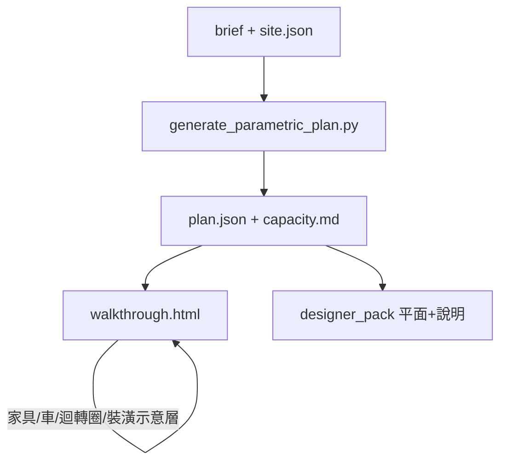

# 前期規劃四塊：讓建築／裝潢師一眼上手

- 日期：2026-08-26
- 狀態：待實作
- 範圍：參數化前期基準（走入式 3D、設計師說明包、裝潢示意層、基地假設可見化）

參數化分支（[`inputs/site.json`](../../../inputs/site.json) + [`inputs/brief/{A,B,C}.json`](../../../inputs/brief/A.json) → [`structured/parametric/`](../../../structured/parametric/)）仍是**唯一設計基準**。HTML 草圖維持存檔，不把尺寸從草圖灌回 brief。

目標不是 BIM，而是開會時三件事一眼成立：**空間夠不夠用、哪些約束不能退、哪些還是假設。**

預設討論變體維持目前唯一雙關都過的 **6 m 開間 × 1 車位**（[`structured/parametric/capacity.md`](../../../structured/parametric/capacity.md)）。

## 實作待辦

1. `fit_furniture.py`：從 `clear_rect` + `kind` 算床／沙發／台面／車占位與是否溢出，並加測試
2. walkthrough：家具、SUV、固定迴轉圈、門淨寬、房間標註與圖層開關
3. `export_parametric_briefing.py`：每棟每層 SVG + index（容量結論、規則清單、開會必問）
4. 裝潢示意圖層：濕區、MDF／IDF 淨空、空調位、無障礙衛浴占位（`assumed`）
5. 基地假設可見：北向、車道、退縮帶、可選鄰房量體；開間旁重申 6 m／1 車

## 1. 走入式 3D：家具、車、迴轉、走道

改 [`scripts/export_walkthrough_3d.py`](../../../scripts/export_walkthrough_3d.py)，家具尺寸只讀 [`scripts/config/residential_defaults_tw.json`](../../../scripts/config/residential_defaults_tw.json) 的 `furniture_mm`／`vehicle`（必要時補：雙人床、床側 900、三座位沙發、六人桌、廚具深 650、輪椅迴轉 1500、休旅車）。

- **示意家具**（預設開）：臥室／孝親放床、客廳沙發、客餐廳加餐桌、廚房沿牆檯面、衛浴馬桶／淋浴占位。用真實 mm，不夠放就畫穿並標紅，**不要縮小家具去遷就房間**（縮小會假裝放得下）。
- **車庫**：一台 SUV 量體＋壁掛充電樁占位；停不進時維持現有 `GARAGE_NOT_PARKABLE` 並在場景裡看得見。
- **輪椅**：需求有 `wheelchair_turn` 的房間在地板畫固定 1500 mm 圈（環繞模式也看得到）；走入＋輪椅模式維持現有跟隨圈。床放進去後圈若被占，圈變紅。
- **門**：洞口旁標淨寬；無障礙門 900 不足則紅。
- **標註**：環繞模式房間名＋淨寬×深；點選顯示「床側剩多少／迴轉圈過不過」。
- 側欄開關：家具、迴轉圈、車、標註。家具可碰撞（走入時繞不過去＝空間不夠）。

抽出小模組（例如 `scripts/lib/fit_furniture.py`）從 `clear_rect` + `kind` 算占位與是否溢出，並加單元測試。不重跑平面產生器也能 export。

## 2. 給設計師的說明包

參數化目前只有 `walkthrough.html` 與 `capacity.md`，**沒有 2D 平面**。建築師開會第一眼要的是帶尺寸的平面，不是只有 3D。

新增 `scripts/export_parametric_briefing.py` → `structured/parametric/briefing/`：

- 每棟每層 SVG（牆、門窗、家具占位、迴轉圈、北向推定、開間×進深、32 坪）。
- `index.html` 一頁導覽：預設變體、三棟順序（右 A 左 C）、容量結論表（只有 6 m／1 車雙關都過）、`plan_rules` 的 error／warning 清單（對應 design_request 的題）。
- 短短「開會必問」：例如孝親房放床後還有沒有 150 cm 圈、廚房能否直通後陽台、RF 設備是否做成有牆設備室（會吃容積）。

誠實標示：**地未定、非建照圖、尺寸由面積反推。** 不把 HTML 歷史 SVG 混進這包。

## 3. 裝潢示意層（不是水電圖）

在走入式與 briefing SVG 加可開關圖層，來源是 brief 註記 + 台灣住宅常識預設，全部標 `assumed`：

- 濕區：衛浴、廚房、後陽台排水靠外牆。
- 弱電：A 棟 MDF、B／C IDF 的維修淨空（短邊 < 900 mm 已有 `EQUIP_ACCESS_TIGHT`）。
- 空調室內機示意位（沿長軸，對應 design_request 常見備註）。
- 無障礙衛浴：150×180 迴轉、橫拉門、側所抓桿占位（示意塊，不是五金圖）。

不畫管線、不指定廠牌。側欄一句話：裝潢師可改位置，但濕區與機櫃不能跟孝親迴轉圈搶同一塊地板。

## 4. 更貼近現場（地仍未定）

不發明地號。在 walkthrough／briefing 把假設變成**可調、可看見、標成假設**：

- **北向／日照**：可旋轉的北向；南向採光房間在環繞模式用較亮窗。
- **車道**：車庫門前畫出駛入帶（休旅車長＋迴轉示意），避免以為車子停在人行道上。
- **退縮／棟距**：現有棟距滑桿保留；外牆外加退縮帶（數字進 `inputs/site.json`，預設註明未測）。
- **鄰房**：可選半透明左右量體（假設面寬），用來談側院通風；預設關。
- 開間滑桿旁固定顯示 capacity 那句話：**兩關都過的只有 6 m × 1 車。**

## 不做

- 不把 HTML 草圖幾何當成實測。
- 不輸出建照、結構、完整水電施工圖。
- 不把家具縮小來「看起來塞得進去」。

## 驗證

- `fit_furniture`：孝親房 `clear_rect` 放 1500×1900 床後剩餘短邊 vs 1500 圈，單元測試。
- 重跑 `export_walkthrough_3d.py` 與新 briefing export。
- 走入 A 棟 1F：看得到床、迴轉圈、廚房檯；輪椅模式繞床；環繞俯視對得上 briefing SVG。
- `index.html` 打開即可讀容量結論與規則清單，不必先懂 repo。
